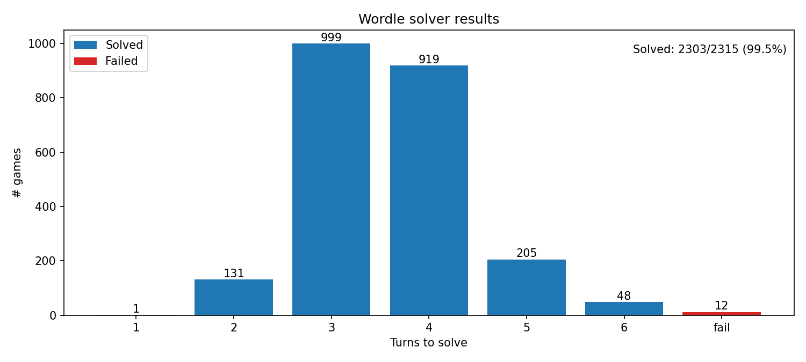

# What's my Wordle?

Wordle solver using information theory (expected information gain/entropy).

This repo contains:
- wordle.py: interactive helper that suggests the next guess
- wordle_tester.py: simulator that runs many games and prints aggregate statistics 


## Interactive solver (wordle.py)

Run with:

```bash
python3 wordle.py --words official_allowed_guesses.txt --answers shuffled_real_wordles.txt
```

Each turn, it prints the top suggestions, then asks for the feedback pattern:
- the guess you used
- g/y/b (green/yellow/black), e.g. bygyb

The first-turn scoring is cached on disk in .first_guess_entropy_cache.json next to wordle.py. This is to speed up repeated runs since the first turn is the slowest, and it's always the same.

### Command line interface
```
=== Wordle Entropy Solver ===
Allowed guesses: 10657
Possible answers: 2315
Feedback input: 5 letters [g,y,b] or digits [2,1,0]. Example: bygyb or 02120
Type 'quit' to exit.

Turn 1 | Remaining candidates: 2315

Top suggestions (guess | expected bits):
  soare  |  5.8860
  roate  |  5.8828
  raile  |  5.8657
  reast  |  5.8655
  salet  |  5.8346
  orate  |  5.8172
  carte  |  5.7946
  raine  |  5.7867
  caret  |  5.7767
  ariel  |  5.7752

Suggested guess: soare

Enter the guess you used (or press Enter to use suggested): 
...
```
After each iteration, the command line will tell you how many remaining words there could be, what the top guesses are and what their expected information gain bits are, to quantify how good a guess is.


## How does it work?

At a high level, the solver treats Wordle as a search problem:

- There is an unknown secret word `s`.
- We keep a set of remaining possible secrets (the “candidates”).
- For any proposed guess `g`, Wordle returns a 5-slot feedback pattern telling you what you learned.
- A good guess is one that, on average, splits the candidates into many similarly-sized groups.

The solver measures “how well a guess splits the candidates” using (Claude) Shannon entropy, measured in bits.

### 1) Feedback: how Wordle responds to a guess

For a given secret `s` and guess `g`, Wordle returns a 5-character pattern.

In this project we represent it as 5 integers, one per position:

- `2` = green: same letter in the same position
- `1` = yellow: letter exists in the word, but in a different position
- `0` = gray: letter does not appear (or you used it too many times)

There are $3^5 = 243$ possible patterns.

Important detail: repeated letters.

Wordle is not “set membership” — it is *counted* membership. For example, if the secret has one `a`,
then only one `a` across your whole guess can be marked green/yellow; extra `a`s become gray.

The implementation in [wordle.py](wordle.py) does a two-pass approach:

1. Mark greens first and decrement a letter counter for the secret.
2. Then mark yellows only if that letter still has remaining count.

This matches the official game behavior.

### 2) Scoring a guess: build a feedback distribution

Suppose there are $N$ candidates remaining. The solver assumes (by default) that each candidate secret is
equally likely.

For a particular guess `g`, we compute the feedback it would produce against every remaining candidate secret:

- For each secret `s` in `candidates`, compute `pattern = feedback(s, g)`.
- Put that secret into a “bucket” for that pattern.

This produces a distribution of pattern counts:

- Let $c_p$ be the number of candidate secrets that produce pattern $p$ for guess `g`.
- Then $\sum_p c_p = N$.
- The probability of seeing pattern $p$ is $P(p) = c_p / N$.

### 3) Entropy: expected information gain (in bits)

Given those pattern probabilities, the solver computes Shannon entropy:

$$
H(g) = -\sum_p P(p)\,\log_2 P(p)
$$

Intuition:

- If a guess produces *almost always the same pattern*, then $H(g)$ is small — the guess doesn’t tell you much.
- If a guess spreads candidates across many patterns with similar probabilities, $H(g)$ is larger — you expect to learn more.

The solver prints this value as “expected bits”.

### 4) Picking the next guess

For each turn the solver evaluates each possible guess in a “guess pool” and picks the one with the highest entropy.

The guess pool is controlled by `--guess-space`:

- `candidates`: only score words that are still possible secrets (often a good default for playing).
- `allowed`: score all allowed guesses, even if they can’t be the secret (can give better “probe” guesses).

### 5) Updating candidates after you type feedback

Once you enter the actual feedback you got from Wordle for the guess you played, the solver filters candidates:

- Keep only the words `s` where `feedback(s, guess) == observed_pattern`.

This is the core “search loop”: score → guess → observe pattern → filter → repeat.

### 6) Why entropy is a good objective

Entropy is a principled way to measure how much uncertainty you expect to remove.

Because we treat the secret as uniformly distributed over the remaining candidates, $H(g)$ is exactly the
expected number of bits of information you gain from playing guess `g` and seeing the resulting pattern.

In practice, maximizing entropy tends to:

- Avoid guesses that don’t discriminate between candidates.
- Prefer guesses that split the candidate set into many smaller groups.

### 7) Performance and caching

A straightforward entropy calculation is expensive:

- For each guess in the pool, we compare it against every remaining candidate.
- That’s roughly $O(|pool| \cdot |candidates|)$ feedback computations per turn.

This repo uses two practical optimizations:

1. Feedback memoization: `feedback(secret, guess)` results are cached in-memory for reuse.
2. First-turn entropy cache: the first turn always starts from the same full candidate set, so the complete
   sorted entropy table is saved to `.first_guess_entropy_cache.json` and loaded on subsequent runs.

### 8) How the tester uses the solver

[wordle_tester.py](wordle_tester.py) runs the same loop automatically for many secrets:

- Choose a secret from the answers list.
- Ask the solver for its best guess.
- Compute the pattern with the same `wordle_feedback()` logic.
- Filter candidates.
- Repeat until solved or `--max-turns` is reached.

It then aggregates results (success rate, average turns, distribution) and can optionally save a matplotlib plot.

## Simulator/stats (wordle_tester.py)

To run:
```bash
python3 wordle_tester.py --words official_allowed_guesses.txt --answers shuffled_real_wordles.txt --guess-space candidates --plot results.png
```

## Output
Simulating: 100%|█████████████████████████████████████████████████████████████████████████████████████████████████████████████████████████████████| 2315/2315 [01:11<00:00, 32.40game/s]
Games: 2315
Solved: 2303 (99.48%)
Failed: 12 (0.52%)
Avg turns (solved): 3.582
Median turns (solved): 4.0
Turn distribution (solved): 1:1, 2:131, 3:999, 4:919, 5:205, 6:48
Most common first guess: raise (2315 / 2315)
Failed examples (up to 10): boxer, tacky, water, latch, waste, foyer, grade, watch, creak, tight
Wrote plot: results.png

## Plot
The plot shows the distribution of the number of turns taken to solve the puzzles, with a bar for each turn count (1 to 6) and a separate bar for failures. The count of games for each bar is shown on top of the bar.




### Word list source
https://github.com/Kinkelin/WordleCompetition/tree/main/data/official

### Original motivation
3Blue1Brown video: https://www.youtube.com/watch?v=v68zYyaEmEA